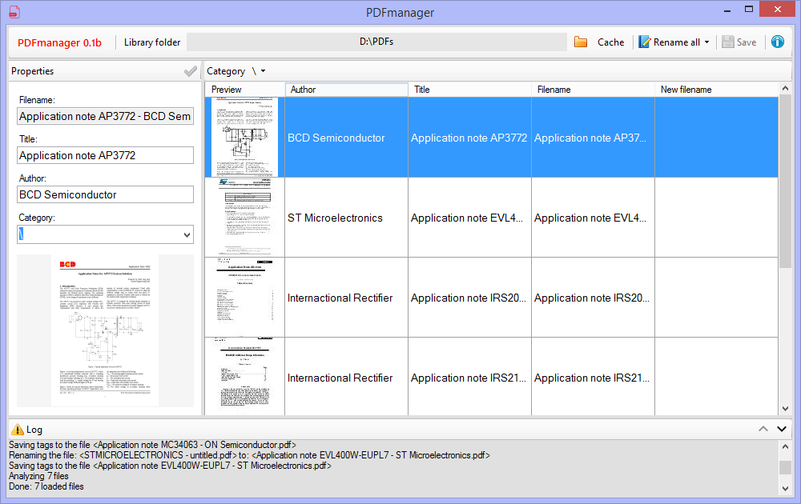

# What?

PDFmanager is a free software developed to help to organize, edit metadata (author and title) and rename all your PDF files based on these informations.

# Why?

Sometimes we need to clean up our library, or classify the files, and there's no simple tool for making it easier, mainly when there's a lot of PDF's.

# Main features

* List files from a folder/subfolders with preview;
* Rename all files, or selected ones, by four name masks:
    * Author - Title.pdf
    * Title - Author.pdf
    * Title (Author).pdf
    * Title.pdf
* Subfolders works as categories, you can:
    * Filter files by category;
    * If you change the category the file will be moved to the new category (folder);
    * If the folder doesn't exists, it will be created;
* The software modifies your files  (TAGs, filename and exclusion) only when clicking on Save * button.

# Tips

1. Click on the preview to open this in your default image visualizer;
2. Double-click over one PDF in the list to open this in your default PDF viewer;
3. Check the "Cache" button for speeding up the file list load on next time you run the application;

# Know issues

Some PDF files can not be open due to codification/protection restrictions.

# Requirements

MS Windows + NET Framework 4.7.2

# Download

## First release (v0.1beta)

[Download here](https://github.com/allancavalari/pdfmanager/releases/tag/v0.1beta)

# Libraries

This software is based on:

* GhostscriptSharp (render PDFs)
* PdfSharp (edit metadata)

Coded with Microsoft® Visual Studio 2019